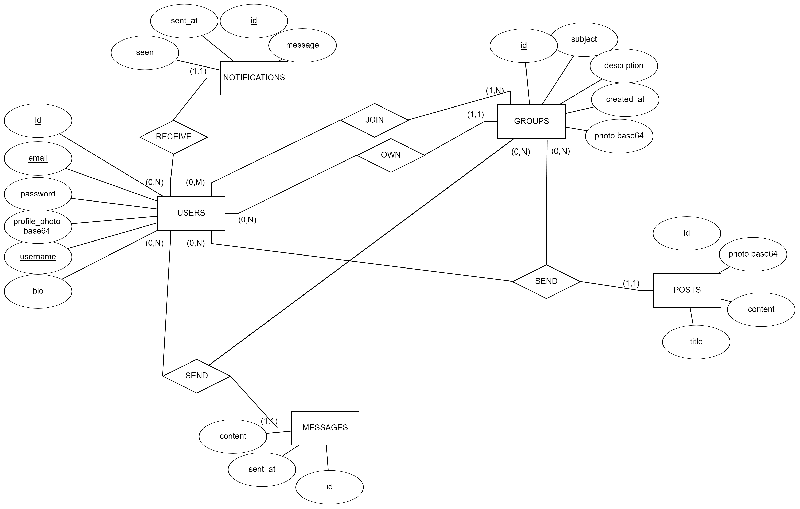

</img>
<hr>
<br>

A social media app that aims to connect people with similar interests in a group chat. allows users to create groups and join groups based on their interests. Users can also create posts and comment on other posts in the same group. <a href="#preview">↓ Design Preview ↓</a>
<br>
<br>
<h1>Stack 📚</h1>

</img>
</img>
</img>
</img>


<br>
<br>
We used android studio to build the UI and link it with the backend, which is built using php and mysql.

Currently, the app database is not hosted on the internet, so you will have to host it yourself. (more on that later)
<br>
<br>

# API's used 📡

As mentioned above we used php for the apis, here is full documentation of the apis we used.
<a href="https://documenter.getpostman.com/view/18920096/2s8YYMmfmh">Postman Documentation</a>

<br>
<br>

# Database 📊

We used mysql for the database, here is the ER diagram of the database.
</img>

<br>
<br>

# Download the app 📲
you can download the app from release section [here](https://github.com/Murf-y/Groupify.git)
<br>
<br>
# Design & Preview 🎨 
Current application design is present in Design folder, available in the repository. It contains the following:
- Figma file of the design
- Preview of the design (Displayed below)


<br>
<br>

# How to run the app 🏃‍♂️ 
- Clone the repository 
```
 git clone  https://github.com/Murf-y/Groupify.git
```

- Open the project in Android Studio
- Press Run Button

- Now that the app is running, you should spin a server for php apis and mysql database. 
- You can use xampp or wampp for that.
If you are using xampp, you can find the php files in the repository in the folder named "php". 
- You can copy the files to the htdocs folder in xampp and run the server. You can also use the database file in the repository to create the database.


# contributors 🤝

- <a href="https://github.com/Murf-y">Murf-y</a>
- <a href="https://github.com/EliasXabs">EliasXabs</a>